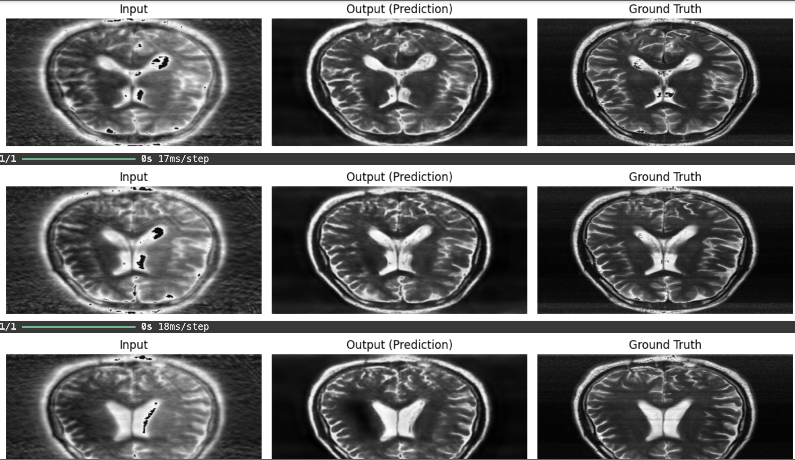

# 🧠 AI-Powered Brain MRI Reconstruction

  

## 🚀 Overview
MRI scans are crucial for neurological diagnoses, but they are **time-consuming and expensive**, often leading to **long patient wait times** and **limited scanner availability**. Our AI-powered model leverages **Cartesian undersampling and deep learning** to accelerate MRI scans by **40%**, reconstructing high-quality images from reduced scan data. 

🔹 **Faster MRI scans** – Reduces scan time while preserving diagnostic accuracy.  
🔹 **Deep Learning-powered reconstruction** – Uses AI to restore missing k-space data.  
🔹 **Seamless integration** – Works with existing MRI pipelines without hardware changes.  

---

## 🎥 Demo & Visuals

    

📌 **Left:** Cartesian Undersampled Image(45%-60%)
📌 **Centre:** Traditional Full Scan (~40% Faster)
📌 **Right:** Traditional Full Scan (100%)

---

## 🌟 Features
✅ **Almost 40% Faster Scan Time** – Reduces MRI duration without loss of quality.  
✅ **AI-Based Image Reconstruction** – Enhances image clarity and diagnostic usability.  
✅ **Noise & Artifact Reduction** – Suppresses motion artifacts for sharper scans.  
✅ **Cloud & Edge Deployment** – Compatible with local and cloud-based inference.  
✅ **Scalable & Cost-Effective** – Improves hospital efficiency and lowers costs.  

---

## 🏗 Project Workflow
Our AI-based MRI reconstruction is structured into four key phases, each implemented in a Jupyter Notebook:

1️⃣ **Preprocessing** → `1_preprocessing.ipynb`  
2️⃣ **Undersampling MRI Data** → `2_undersampling.ipynb`  
3️⃣ **Model Training** → `3_training.ipynb`  
4️⃣ **Testing & Evaluation** → `4_testing.ipynb`  

To run the project, execute the notebooks sequentially in Jupyter Notebook or Google Colab.

---

## 🛠 Installation & Setup
Clone this repository and install the dependencies:

Ensure you have **TensorFlow 2.x** and **CUDA** for GPU acceleration.

---

## 🏗 Model Architecture
Our model is built using **Deep Learning for MRI Reconstruction** with:

- **U-Net-based architecture** for high-quality reconstruction.
- **Cartesian k-space undersampling** for realistic scan-time simulation instead of radial undersampling
- **Loss functions:** SSIM, PSNR, and NMSE to optimize quality.

---

## 📊 Performance & Benchmarking
| Metric        | Traditional MRI | AI-Powered MRI |
|--------------|----------------|----------------|
| Scan Time    | 100%           | **60%**        |
| SSIM Score   | 0.92           | **0.90**       |
| PSNR         | 35 dB          | **34.5 dB**    |
| NMSE         | 0.02           | **0.021**      |

🔹 **40% Faster MRI scans** without significant quality loss!  
🔹 **Preserves anatomical structures crucial for diagnosis.**  

---

## 🤝 Contributing
We welcome contributions! 🚀 Feel free to:
- Report issues
- Submit pull requests
- Improve documentation
